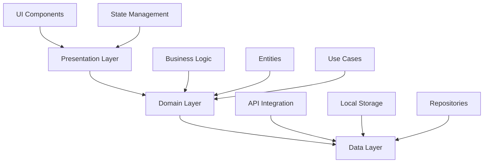

<div align="center">

# 🎬 Movie Database App

**A modern, cross-platform movie database application built with Flutter**

*Browse, search, and discover detailed information about your favorite movies*

[](https://flutter.dev)
[](https://dart.dev)
[](LICENSE)

</div>

---

## 📸 Screenshots

<div align="center">
  
  
  
</div>

---

## ✨ Features

<table>
<tr>
<td width="50%">

### 🎯 Core Features
- 🔍 **Search** movies by title
- 📋 **Browse** popular and latest movies
- ⭐ **View** detailed movie information
- 🎭 **Filter** by genres
- ❤️ **Save** favorite movies

</td>
<td width="50%">

### 🚀 Advanced Features
- 💾 **Offline support** with caching
- 🌙 **Dark/Light** theme support
- 📱 **Responsive** design
- 🎥 **Watch** trailers
- ⚡ **Fast** and smooth performance

</td>
</tr>
</table>

---

## 🛠️ Tech Stack

<div align="center">

| Category | Technology |
|----------|-----------|
| **Framework** | Flutter |
| **Language** | Dart |
| **State Management** | Riverpod |
| **API** | TMDB API |
| **Architecture** | Clean Architecture |
| **Local Storage** | Hive |
| **Networking** | Dio |
| **Navigation** | AutoRoute |
| **Code Generation** | Freezed, JSON Serializable |

</div>

---

## 📁 Project Structure

```
lib/
├── 📂 config/              Configuration files (API keys, constants)
├── 📂 core/               Core utilities and base classes
│   ├── 📂 error/          Error handling
│   ├── 📂 network/        Network utilities
│   └── 📂 theme/          App theming
├── 📂 data/               Data layer
│   ├── 📂 models/         Data models 
│   ├── 📂 repositories/   Repository implementations
│   └── 📂 datasources/    Remote & Local data sources 
├── 📂 domain/             Business logic layer
│   ├── 📂 entities/       Domain entities
│   ├── 📂 repositories/   Repository interfaces
│   └── 📂 usecases/       Business use cases 
├── 📂 presentation/       UI layer
│   ├── 📂 pages/          Screen widgets
│   ├── 📂 widgets/        Reusable widgets
│   ├── 📂 providers/      Riverpod providers
│   └── 📂 routes/         AutoRoute navigation
└── 📄 main.dart           Application entry point
```

---

## 📦 Key Dependencies

<details>
<summary><b>Production Dependencies</b></summary>

```yaml
dependencies:
  # State Management
  flutter_riverpod: ^2.5.1
  riverpod_annotation: ^2.3.5
  
  # Networking
  dio: ^5.4.0
  
  # Local Storage
  hive_flutter: ^1.1.0
  
  # Functional Programming
  fpdart: ^1.1.0
  
  # Code Generation
  freezed_annotation: ^2.4.1
  json_annotation: ^4.9.0
  
  # UI
  cached_network_image: ^3.3.1
  shimmer: ^3.0.0
  
  # Navigation
  auto_route: ^9.2.2
```

</details>

<details>
<summary><b>Development Dependencies</b></summary>

```yaml
dev_dependencies:
  # Code Generation
  build_runner: ^2.4.8
  freezed: ^2.4.7
  json_serializable: ^6.8.0
  riverpod_generator: ^2.4.0
  auto_route_generator: ^9.0.0
  
  # Testing
  mocktail: ^1.0.3
```

</details>

---

## 🏗️ Architecture

<div align="center">



</div>

This project follows **Clean Architecture** principles with three main layers:

- 🎨 **Presentation Layer:** UI components, widgets, and state management
- 💼 **Domain Layer:** Business logic, entities, and use cases  
- 📊 **Data Layer:** API integration, local storage, and repositories

---

## 📝 License

This project is licensed under the **MIT License** - see the [LICENSE](LICENSE) file for details.

---

<div align="center">

**Made with ❤️ using Flutter**

